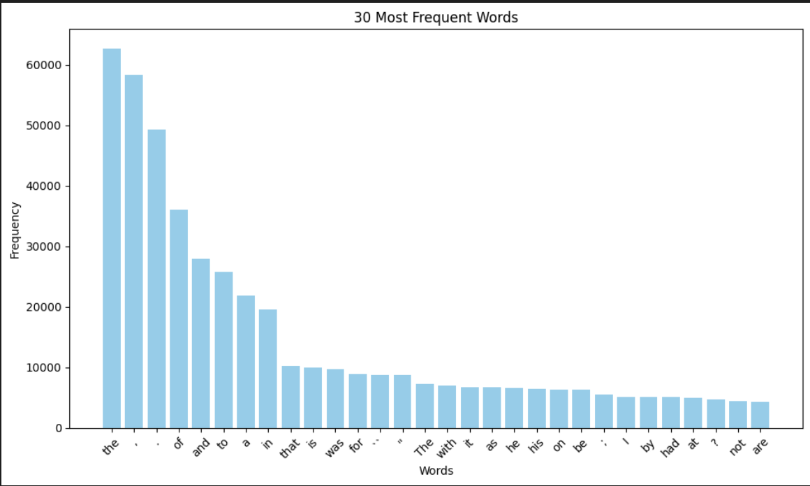
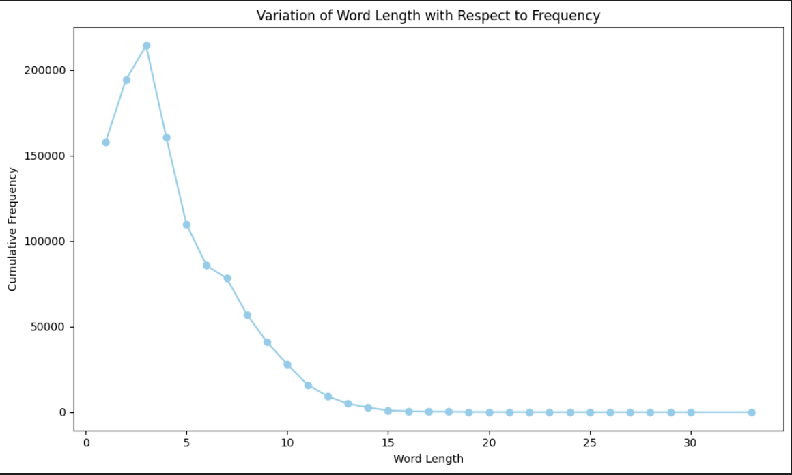
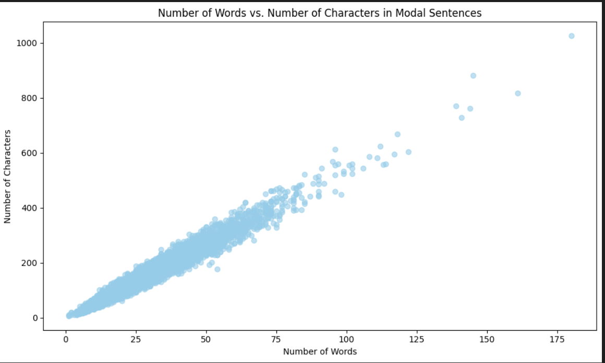
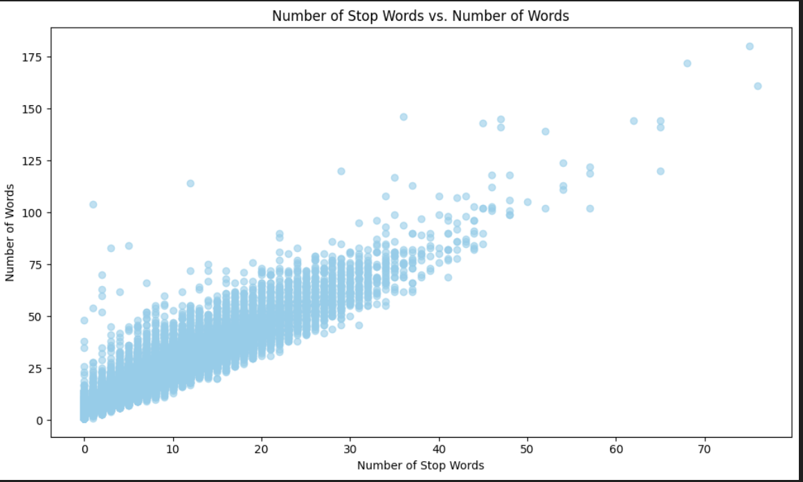
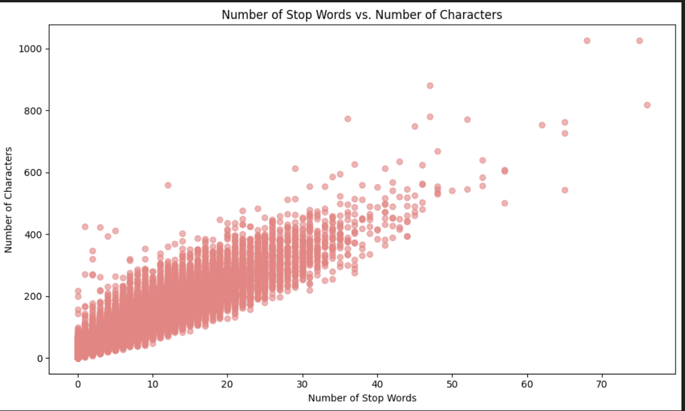

# Brown-Corpus-Word-Frequency-Analysis
UniversityOfOulu/NLP/Lab1

This notebook analyzes word frequency using the **Brown Corpus** and includes several visualizations. 

### Requirements
Make sure you have these libraries installed:
- `nltk`
- `matplotlib`
- `beautifulsoup4`
- `requests`

Install them with:
```bash
pip install nltk matplotlib beautifulsoup4 requests
```

## How to Run
1. Clone the repo and run the notebook.
2. The necessary NLTK datasets will download automatically.
3. Outputs, including frequency data and visualizations, will be generated.

## Key Features

1. **Word Frequency Analysis**: Analyzes word frequency from the Brown Corpus and saves it in `word_freq.txt`.

2. **Visualizations**: Generates charts for:
   - 30 Most Common Words 
   - 30 Least Common Words
   - Word Length vs Frequency 

3. **Modal Verbs Analysis**: Analyzes modal verbs and plots their usage .

4. **Stopwords Analysis**: Explores relationships between stopwords and sentence lengths  .

5. **Web Tokenization**: Tokenizes content from a webpage and saves the results in `web_output.txt`.